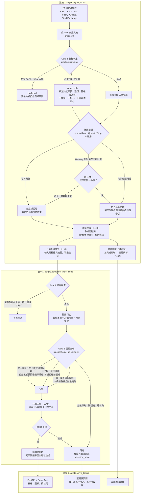

# Delta AI 趨勢日報

替台達同仁做 AI 趨勢情報的自動化系統。每天從 26 個公開來源抓 AI 相關內容，
把同一件事的多篇報導聚成「話題」，依台達各單位對應的 18 個模組打分，過門檻
的寫成中文短文出日報，每週一挑最重要的 10 則出週報，文章裡的實體關係同步
累積成 Neo4j 知識圖譜。

三個入口對應三個階段，彼此完全脫鉤，各自可以獨立重跑：

| 入口 | 做什麼 |
|---|---|
| `scripts/ingest_topics.py` | 建池：抓取、收錄判定、聚類、標籤、建圖、打分 |
| `scripts/compose_topic_issue.py` | 出刊：選題、生成、自檢、存檔 |
| `scripts/serve_topics.py` | 網頁：日報、週報、領域頁、知識圖譜、選題帳 |

## 系統流程



## 判斷機制與門檻

門檻值全部集中在 `config/topics.yaml`，程式裡只有判斷邏輯。每個值怎麼定的
寫在 `docs/DECISIONS.md`（本地文件），不憑感覺調。目前的主要數值：

| 機制 | 門檻 | 邏輯 |
|---|---|---|
| Gate 1 收錄 | 內文 200 字、30 天、須 AI 相關 | 短的降級成 signal_only，舊的與非 AI 的 excluded。被擋的留在池裡不刪，省的是 LLM 額度不是硬碟 |
| 話題聚類 | 相似度 0.72 | 單一連結式貪婪聚類。top 5 鄰居過門檻就併入，鄰居分屬多個話題時觸發話題合併（已出刊的除外） |
| title-only 聚類 | 門檻 0.80、灰色地帶 0.65 到 0.85 | 只有標題的文章 embedding 會塌在一起，門檻切不開，灰色地帶改問 LLM「是不是同一件事」，判不出來偏向不併 |
| 實體解析 | 灰色地帶 0.15 到 0.85 | 同一套模式：夠低直接判不同、夠高直接判相同，中間才花 LLM 額度 |
| 熱門度 | 半衰期 3.5 天 | 報導家數（不重複來源數）× 平均來源權重 × 時間衰減 |
| 選題 | 模組分下限 6.0 | 三輪：模組輪動保覆蓋、總分遞補、保底輪。content_type 與模組群各有配額，案例來源另有 tier_cap 防廠商業配吃版位 |

三個共通設計，改東西之前要知道：

1. 冪等是底線。每一步只處理「還沒做過那一步」的資料，任何一步中斷重跑
   會自動接續
2. 拒絕不等於刪除。被擋掉、落選的都留著理由碼跟數值，選題帳頁面直接讀
3. 灰色地帶模式。聚類跟實體解析都是便宜計算先分流、模型只判中間地帶，
   LLM 失敗時一律往保守方向判

## 目錄結構

| 目錄 | 內容 |
|---|---|
| `ingestion/` | 各來源抓取器。共通資料契約是 `base.py` 的 `RawItem` |
| `pipeline/` | 核心邏輯：收錄關卡（gates）、聚類（topic_clustering）、標籤（article_tagging）、打分（module_scoring）、選題（topic_selection）、資料層（topic_db）、向量庫（vector_store）、翻譯、週報專欄（delta_column）、圖譜（triple_extraction、entity_resolution、graph_store） |
| `generation/` | 文章生成 |
| `review/` | 出刊前自檢 |
| `scripts/` | 三個入口＋排程用的 run_daily.ps1、run_weekly.ps1、start_neo4j.ps1 |
| `prompts/` | 所有 LLM 指令（system、user 兩段式，prompt_loader 讀） |
| `config/topics.yaml` | 唯一的設定檔：來源清單、模組定義、門檻、配額 |
| `templates/` | 網頁模板（Jinja2） |
| `tools/` | 補資料與評測工具（backfill_*、eval_*、repair_*） |
| `tests/` | 冒煙測試與固定測資 |
| `legacy/` | 已凍結的前兩條產品線，不再維護，跑不起來是刻意的 |

資料落點（都不進版控）：SQLite 在 `data/topics.db`，語意向量在 `data/qdrant`
（Qdrant embedded 模式，不用起伺服器），知識圖譜在 Neo4j，LLM 呼叫全紀錄在
`llm_logs/`，排程紀錄在 `runs/`。

## 快速開始

```bash
pip install -r requirements.txt
cp .env.example .env    # 填 LLM_API_KEY、LLM_BASE_URL、NEWSLETTER_MODEL

python -m scripts.ingest_topics --concurrency 8 --build-graph   # 建池
python -m scripts.compose_topic_issue --date 2026-08-27 --cadence daily   # 出刊
python -m scripts.serve_topics    # 網頁：http://localhost:8001
```

排程走 Windows 工作排程器，錯過會補跑：

| 工作 | 時間 | 做什麼 |
|---|---|---|
| DeltaAI-DailyIssue | 每天 12:00 | `run_daily.ps1`：起 Neo4j、建池含建圖、出前一天日報 |
| DeltaAI-WeeklyIssue | 每週一 12:10 | `run_weekly.ps1`：出上週的週報，含台達專欄與大標題 |

內容僅供台達內部參考，請勿外流。
