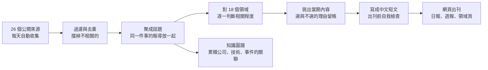

# Delta AI 趨勢日報

替台達同仁整理 AI 動態的自動化電子報。系統每天從二十多個公開來源收集 AI
相關內容，判斷每一篇跟台達哪些事業有關，值得看的寫成中文短文出刊。

## 你會看到什麼

**日報**：每天中午更新，收錄前一天所有夠相關的內容。第一則是當天頭條，
其餘用卡片排列，點卡片看全文。

**週報**：每週一出刊，回顧上一週最重要的 10 則。最上方是「台達專欄」，
各事業領域一格，一句主題大標題點出當週主軸，例如「算力衝撞電網：德州斷接、
自建電廠與代理規模化」。

**領域頁**：首頁點你的領域（能源電力、製造廠務、法務合規等 18 個），
看跟你工作相關的所有文章，新的在前。一篇文章同時跟幾個領域有關，就會
出現在幾個頁面，不用擔心漏看。

**知識圖譜**：文章裡出現的公司、技術、事件的關聯圖，可以拖拉縮放，
看這陣子誰跟誰常一起出現。

每篇文章可以切英文跟簡體中文，右下角有意見回饋按鈕。

## 怎麼開始看

用公司網路開啟系統網址（網址與帳號密碼向維護者索取）。第一次會跳出
登入框，輸入一次瀏覽器就會記住。

- 只想每天花三分鐘：看日報
- 想掌握一週重點：看週報跟台達專欄
- 只關心自己領域：把你的領域頁加入書籤

## 內容是怎麼來的

從收集、判斷相關性、挑選到寫作全部由系統自動完成，每天中午自動更新，
不需要人工操作。整個流程長這樣：

每一篇的來源連結都附在文章裡；每一期「為什麼選這篇、
為什麼沒選那篇」在選題帳頁面都查得到。發現內容有誤或分類不準，用頁面
右下角的回饋按鈕告訴我們，修正會回溯套用到整個資料庫。

## 常見問題

**為什麼有些日子文章多、有些少？** 篇數跟著當天實際的內容量走，只有
夠相關的才會刊出，不會為了湊版面放不相關的內容。

**為什麼我的領域有時候沒新文章？** 代表當天來源裡真的沒有跟這個領域
夠相關的內容。系統持續在擴充來源，涵蓋會越來越完整。

**內容可以轉發嗎？** 僅供台達內部參考，請勿外流。
